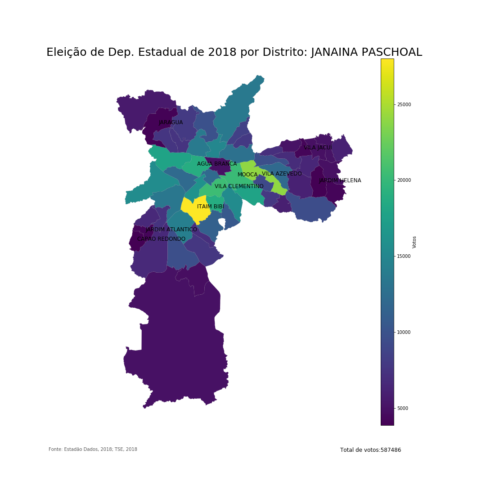
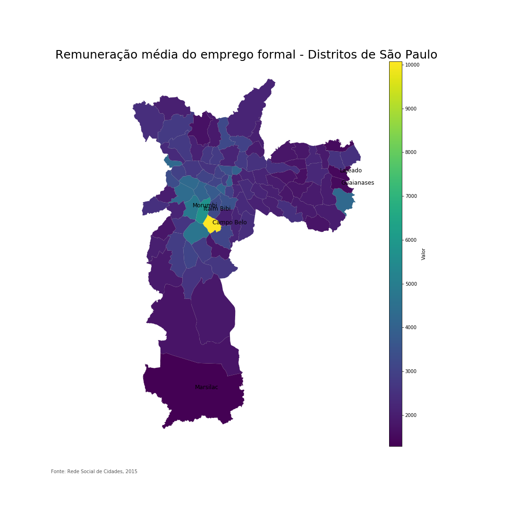
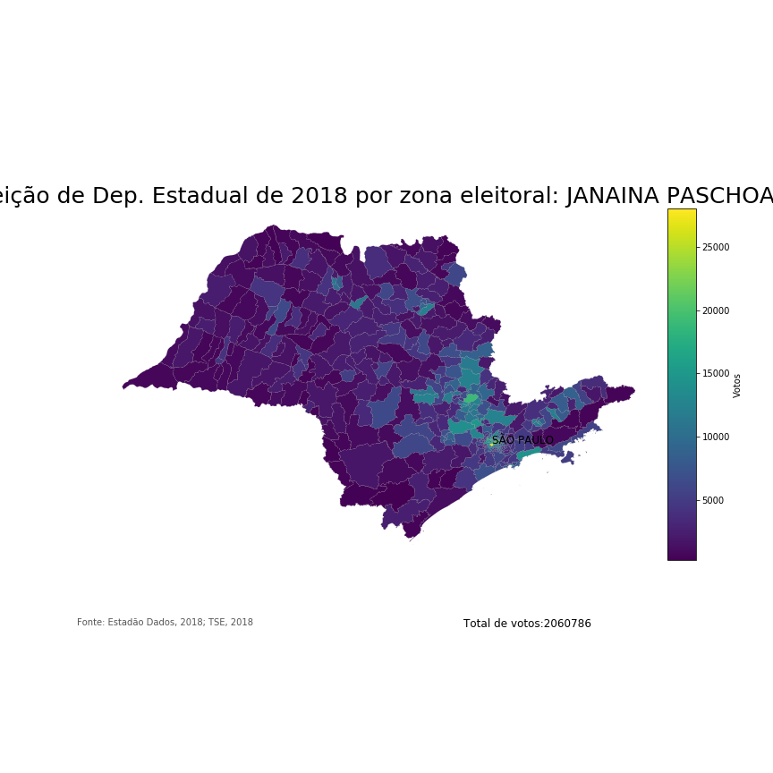

# Mapa da eleição de Dep. Estadual de 2018 por Zona Eleitoral

Exibir mapa de votos da eleição de 2018 para deputado estadual por zona eleitoral no Estado e na Cidade de São Paulo.

## Ferramentas
- Matplotlib
- Bokeh

# Melhorias
Fazer correlação de votos por distrito vs remuneração média
- Criar tabela de correspondência entre Zonas Eleitorais (total:58) e Distritos (total:96).

